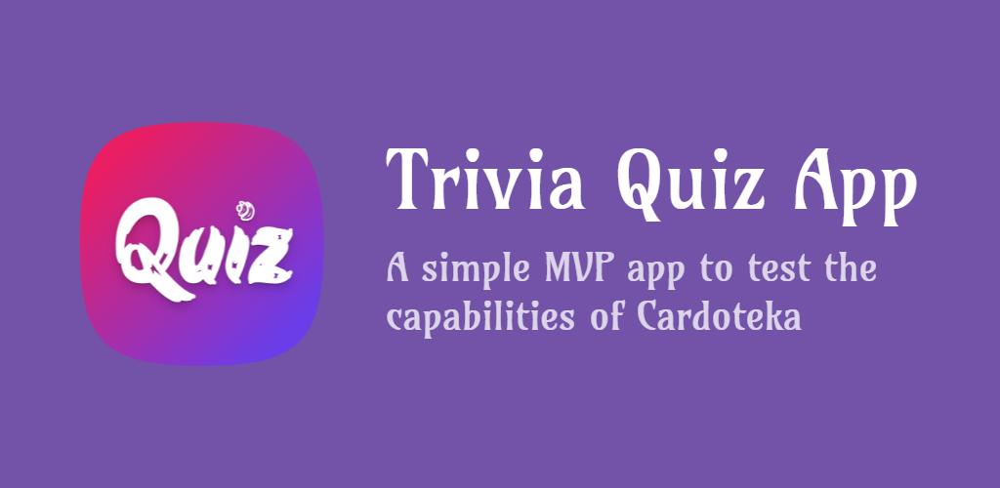
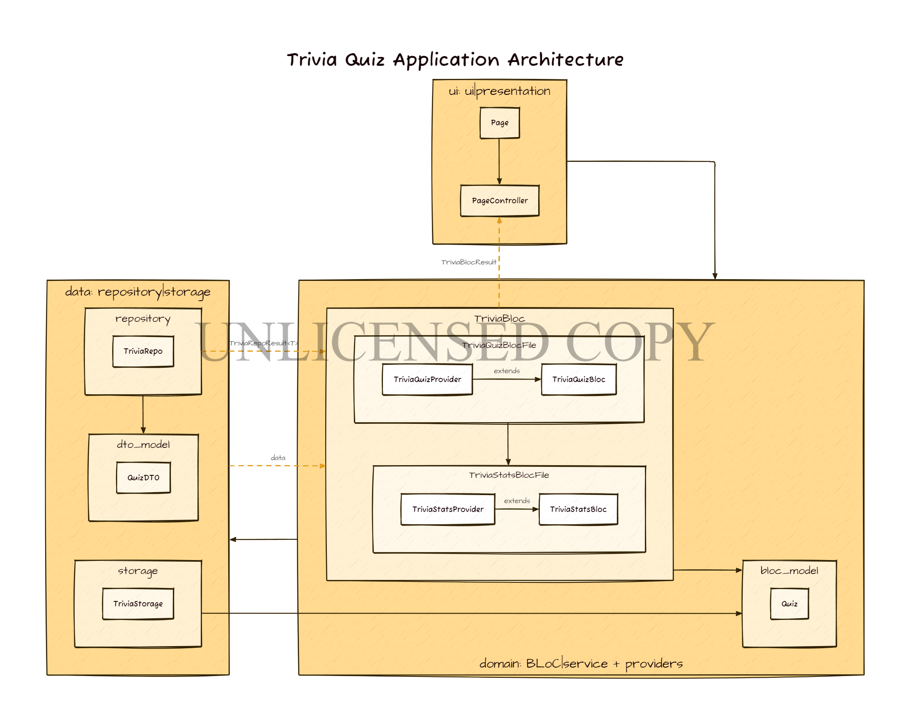

# Quiz Prize App

A simple MVP quiz app to test the capabilities of Cardoteka.

**Documentation in progress**

Made with [Trivia API](https://opentdb.com/api_config.php) and [Dart 3.0](https://dart.dev/resources/dart-3-migration).

## Technologies used

- [Flutter](https://flutter.dev/) – framework for creating applications. Love;
- [Riverpod](https://github.com/rrousselGit/riverpod) – application state manager, dependency management (including injection). Personal thanks to _Remi Rousselet_;
- [Cardoteka](https://github.com/PackRuble/cardoteka) – typed wrapper over [SharedPreferences](https://pub.dev/packages/shared_preferences) for convenient storage of local data;
- [freezed](https://pub.dev/packages/freezed) – creation of immutable objects and their simple change;
- [json_serializable](https://pub.dev/packages/json_serializable) – working with json;
- [weather_animation](https://github.com/PackRuble/weather_animation) – lovely background animation;
- [confetti](https://github.com/funwithflutter/flutter_confetti) – beautiful confetti for the correct answer;
- [lint](https://pub.dev/packages/lint) – set of strict rules for development;

and others in [pubspec.yaml](pubspec.yaml)...❤

## Architectural delights

- structure our project – _layer-first_
- BLoC uses

## Notes

- no session token implementation – which means an infinite number of questions that can be repeated.

