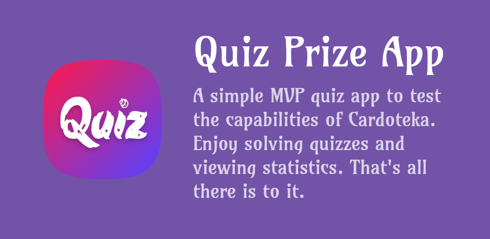

# Quiz Prize App

A simple MVP quiz app to test the capabilities of [Cardoteka][cardoteka_github_link].

You can launch the application simply by following the link and enjoy the web version — [Quiz Prize Web](https://packruble.github.io/quiz_prize_app/) 🎉🎉🎉! Also visit the [releases](https://github.com/PackRuble/quiz_prize_app/releases) tab and check the available platforms.

In any other cases, clone this repository locally and run it with the `flutter run` command.

Made with [Trivia API](https://opentdb.com/api_config.php) and [Dart 3.0](https://dart.dev/resources/dart-3-migration). Available under Apache-2.0 license.

## Goals of this application

- ✅ realization of unidirectional data flow between layers
- ✅ reactively update state of notifiers using `Watcher` from the `cardoteka` package
- ✅ implementation of presenters and notifiers using the `riverpod` package
- ✅ convenient "ui->domain->data" style folder architecture
- ✅ communication between layers using sealed states
- ✅ analyze different approaches to interacting with local storage: reactive interaction, standard `get`|`set`, synchronous initialization
- ✅ creating adaptive interface for different platforms (web|android|windows)
- ✅ verifying that the [cardoteka][cardoteka_pub_link] package is ready for public release and for use in production

## Technologies used

- [Flutter](https://flutter.dev/) – framework for creating applications. Love;
- [Dart](https://dart.dev/) – a language that is a pleasure to write code in (thanks!)
- [Riverpod](https://github.com/rrousselGit/riverpod) – application state manager, dependency management (including injection). Personal thanks to Remi Rousselet;
- [Cardoteka][cardoteka_github_link] – typed wrapper over [SharedPreferences](https://pub.dev/packages/shared_preferences) for convenient storage of local data (own research);
- [freezed](https://pub.dev/packages/freezed) – creation of immutable objects and their simple change;
- [json_serializable](https://pub.dev/packages/json_serializable) – working with json;
- [weather_animation](https://github.com/PackRuble/weather_animation) – lovely background animation;
- [confetti](https://github.com/funwithflutter/flutter_confetti) – without him there would be no holiday!;
- [lint](https://pub.dev/packages/lint) – set of strict rules for development;

and others in [pubspec.yaml](pubspec.yaml)...❤

## Architectural delights

- structure our project — _layer-first_ — 3 layers (ui, domain, data)
- unidirectional reactive data flow
- each layer has its own models as needed
- updating states based on immutable data
- using sealed classes as exhaustive states
- clear separation of layers and responsibilities

_Note that not all elements are involved. The emphasis is on interaction:_
> `GamePage` -> `GamePagePresentor` -> `QuizGameNotifier` -> `Notifiers` -> `Repo&Cardoteka`

## Author contact

You can contact me or check out my activities on the following platforms:

- [Telegram Group](https://t.me/+AkGV73kZi_Q1YTMy)
- [StackOverflow](https://stackoverflow.com/users/17991131/ruble)
- [Medium](https://medium.com/@pack.ruble)
- [Habr](https://habr.com/ru/users/PackRuble/)
- [Github](https://github.com/PackRuble)

[cardoteka_pub_link]: https://pub.dev/packages/cardoteka
[cardoteka_github_link]: https://github.com/PackRuble/cardoteka